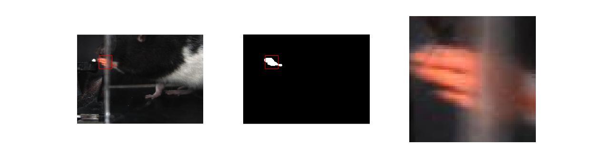
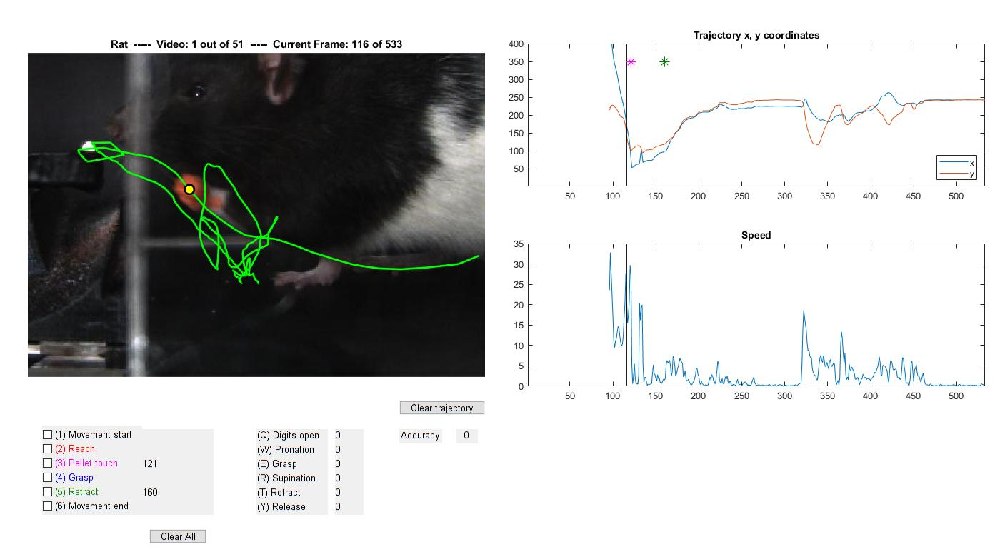

# PawTrack

## Description
1. Automatically finds x,y coordinates of rat paw from lateral video of reach-to-grasp task 
    * Interpolates paw when it is obstructed by front wall
2. Automatically find frame numbers when rat touches pellet, and when rat retracts paw
3. GUI to adjust/add trajectories and markers
4. Now incorporates results from [DeepLabCut](http://www.mousemotorlab.org/deeplabcut) to automatically find frames when rat initiates movement and reaches. 

## Usage
Open and follow instructions in
- start.m : uses image processing without DeepLabCut
- start_dlc.m : incorporates results from DeepLabCut to improve event detection (reach start, etc.)

## Keyboard shortcuts
- right arrow: advance by 1 frame
- left arrow: move back by 1 frame
- up arrow: advance by 10 frames
- down arrow move back by 10 frames
- d: move to next time marker
- s: move to previous time marker
- a: go to next trial

